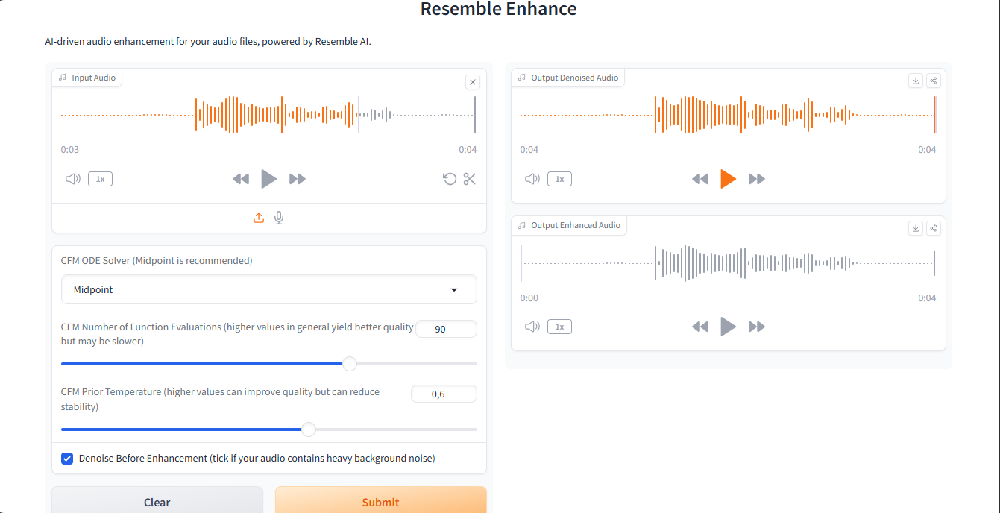

# Resemble Enhance demo: MLOps with Hugging Face Space, Gradio and Github Actions

Demo of Resemble Enhance, an AI-powered tool that aims to improve the overall quality of speech by performing denoising and enhancement. It consists of two modules: a denoiser, which separates speech from a noisy audio, and an enhancer, which further boosts the perceptual audio quality by restoring audio distortions and extending the audio bandwidth. The two models are trained on high-quality 44.1kHz speech data that guarantees the enhancement of your speech with high quality.

# Demo Space on Hugging Face 🤗

  
[Try Demo Here](https://anyantudre-resemble-enhance-demo.hf.space)  
Current version is slow... (running on CPU)

# CI/CD Workflow

## References
- [Resemble Enhance GitHub](https://github.com/resemble-ai/resemble-enhance)
- [YouTube MLOps with Hugging Face Spaces, Gradio and Github Actions](https://youtu.be/VYSGjUa5sc4)
